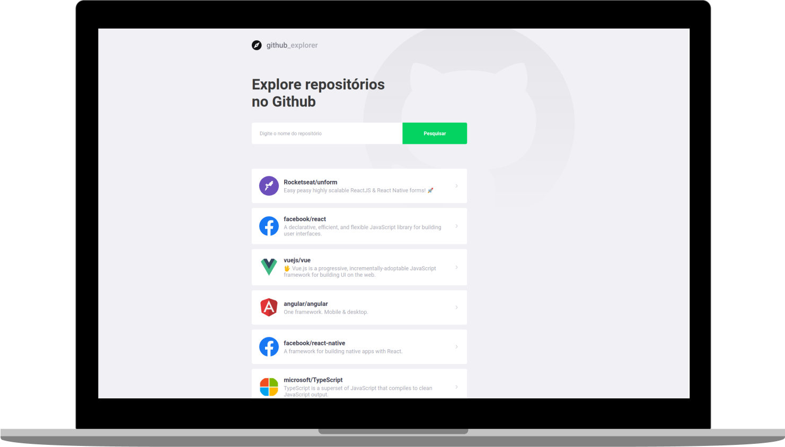

<h1 align="center">
  
</h1>
<h4 align="center">
  The Github Explorer is a project that aims to search repositories
</h4>
<p align="center">
  

  

  <a href="https://www.codacy.com/manual/gfgabrielfranca/github-explorer?utm_source=github.com&utm_medium=referral&utm_content=gfgabrielfranca/github-explorer&utm_campaign=Badge_Grade">
    
  </a>

  

  <a href="https://github.com/gfgabrielfranca/github-explorer/commits/master">
    
  </a>

  <a href="https://github.com/gfgabrielfranca/github-explorer/issues">
    
  </a>

  
</p>

<p align="center">
  <a href="#rocket-technologies">Technologies</a>&nbsp;&nbsp;&nbsp;|&nbsp;&nbsp;&nbsp;
  <a href="#information_source-how-to-use">How To Use</a>&nbsp;&nbsp;&nbsp;|&nbsp;&nbsp;&nbsp;
  <a href="#memo-license">License</a>
</p>

<p align="center">
  
</p>

<p align="center">
  <a href="https://gfgabrielfranca-github-explorer.netlify.app/">
    
  </a>
</p>

## :rocket: Technologies

This project was developed in the GoStack by [Rocketseat](https://rocketseat.com.br/) with the following technologies:

- [ReactJS](https://pt-br.reactjs.org/)
- [TypeScript](https://www.typescriptlang.org/)
- [Axios](https://github.com/axios/axios#readme)
- [Styled Components](https://styled-components.com/)
- [Polished](https://polished.js.org/)

## :information_source: How To Use

To clone and run this application, you'll need [Git](https://git-scm.com), [Node.js v12.16](https://nodejs.org/) or higher + [Yarn v1.22](https://yarnpkg.com/) or higher installed on your computer. From your command line:

```bash
# Clone this repository
$ git clone https://github.com/gfgabrielfranca/github-explorer

# Go into the repository
$ cd github-explorer

# Install dependencies
$ yarn

# Run the app
$ yarn start
```

## :memo: License

This project is under the MIT license. See the [LICENSE](https://github.com/gfgabrielfranca/github-explorer/blob/master/LICENSE) for more information.

---

Made with ♥ by Gabriel França :wave: [Get in touch!](https://www.linkedin.com/in/gabrielfrancas/)
